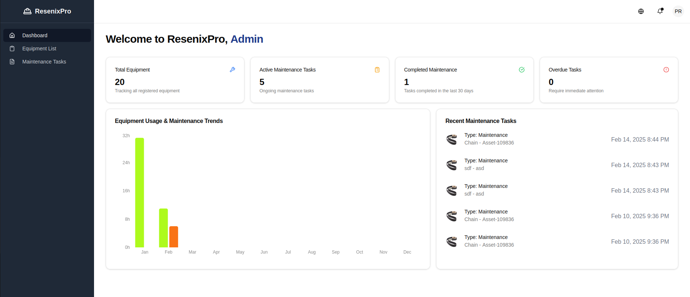

# ResenixPro - Industrial Equipment Management System

<div align="center">
  
  
  
  
  
</div>

[Features](#features) • [Installation](#installation) • [Documentation](#documentation) • [Contributing](#contributing) • [License](#license)

## Overview

ResenixPro is an enterprise-grade equipment management and maintenance tracking system designed to help industrial organizations optimize their maintenance schedules, track equipment health, reduce downtime, and enhance operational efficiency through real-time monitoring.

## Features

### 🔧 Equipment Management
- Comprehensive equipment inventory tracking
- Real-time status monitoring
- Detailed maintenance history
- Asset utilization analytics
- Equipment lifecycle management

## Installation

### Prerequisites

- Node.js 18.x or higher
- npm/yarn
- Firebase account

### Quick Start

1. Clone the repository:
```bash
git clone https://github.com/ZineddineBk09/Equipment-Managment-App.git
cd Equipment-Managment-App
```

2. Install dependencies:
```bash
npm install
```

3. Configure Environment Variables:
```bash
cp .env.example .env.local
```

4. Update `.env.local` with your Firebase credentials:
```bash
NEXT_PUBLIC_FIREBASE_API_KEY=your_api_key
NEXT_PUBLIC_FIREBASE_AUTH_DOMAIN=your_auth_domain
NEXT_PUBLIC_FIREBASE_PROJECT_ID=your_project_id
NEXT_PUBLIC_FIREBASE_STORAGE_BUCKET=your_storage_bucket
NEXT_PUBLIC_FIREBASE_MESSAGING_SENDER_ID=your_messaging_sender_id
NEXT_PUBLIC_FIREBASE_APP_ID=your_app_id
```

5. Start the development server:
```bash
npm run dev
```

## Project Structure

```
equipment-mgmt/
├── src/
│   ├── app/                 # Next.js app directory
│   ├── components/          # Reusable UI components
│   ├── hooks/              # Custom React hooks
│   ├── lib/                # Utility functions and configurations
│   ├── interfaces/         # TypeScript interfaces
│   └── enums/              # TypeScript enums
└── public/           # Static assets
```

## Key Features Demo

### Equipment Management
<div align="center">
  
</div>

### Maintenance Scheduling
<div align="center">
  
</div>

### Analytics Dashboard
<div align="center">
  
</div>

## Configuration

### Firebase Setup

1. Create a new Firebase project
2. Enable Authentication and Firestore
3. Add a web app to get your credentials
4. Update environment variables

### Environment Variables

| Variable                           | Description          | Required |
| ---------------------------------- | -------------------- | -------- |
| `NEXT_PUBLIC_FIREBASE_API_KEY`     | Firebase API Key     | Yes      |
| `NEXT_PUBLIC_FIREBASE_AUTH_DOMAIN` | Firebase Auth Domain | Yes      |
| `NEXT_PUBLIC_FIREBASE_PROJECT_ID`  | Firebase Project ID  | Yes      |

## Contributing

We welcome contributions! Please follow these steps:

1. Fork the repository
2. Create a feature branch: `git checkout -b feature/my-feature`
3. Commit changes: `git commit -am 'Add my feature'`
4. Push to branch: `git push origin feature/my-feature`
5. Submit a Pull Request

## Testing

Run the test suite:

```bash
npm run test
```

Run specific tests:

```bash
npm run test:unit    # Unit tests
npm run test:e2e     # E2E tests
```

## Deployment

### Vercel Deployment

1. Connect your GitHub repository to Vercel
2. Configure environment variables
3. Deploy with:

```bash
vercel --prod
```

## License

This project is licensed under the MIT License - see the [LICENSE](LICENSE) file for details.


## Roadmap

### Q1 2024
- [ ] Mobile application development
- [ ] Advanced analytics dashboard
- [ ] API documentation

### Q2 2024
- [ ] IoT sensor integration
- [ ] Predictive maintenance features
- [ ] Multi-language support

## Contributors

<a href="https://github.com/ZineddineBk09/Equipment-Managment-App/graphs/contributors">
  
</a>

## Acknowledgments

- [Shadcn/ui](https://ui.shadcn.com/) for the UI components
- [Firebase](https://firebase.google.com/) for the backend infrastructure
- All contributors who have helped shape ResenixPro

---

<div align="center">
  Made with ❤️ by <a href="https://github.com/ZineddineBk09">Zineddine Benkhaled</a>
</div>